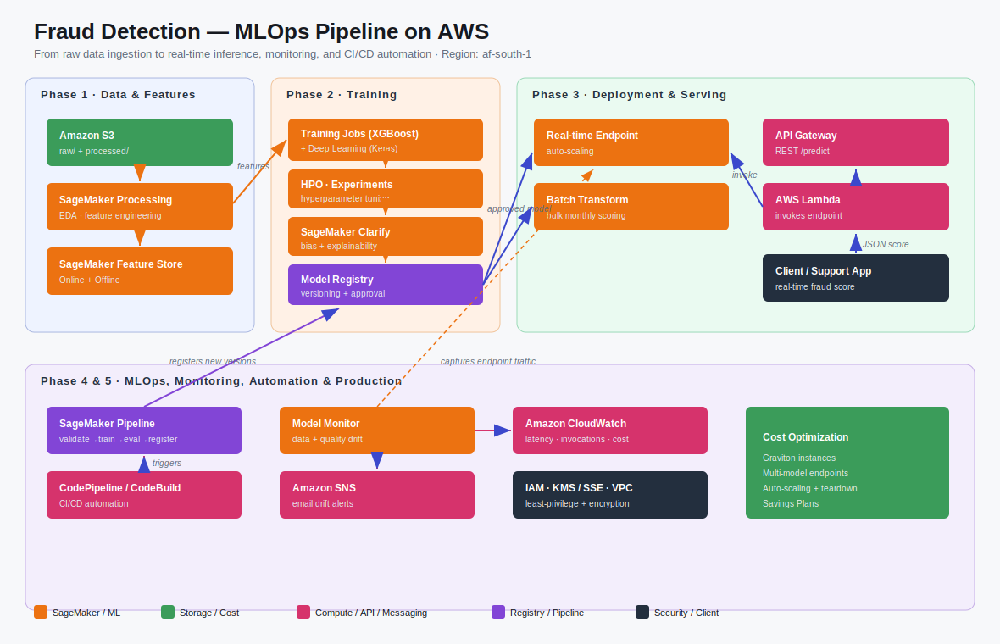

# Fraud Detection — Production-Grade MLOps Pipeline on AWS

End-to-end machine learning system built on Amazon SageMaker, covering the full
lifecycle from raw data ingestion to real-time inference, batch scoring, model
monitoring, and CI/CD automation.

> **Assignment:** *Building a Production-Grade MLOps Pipeline for Prediction on AWS
> (From Data to Live Monitoring).* The brief permits any dataset of the team's
> choice; we use the **Credit-Card Fraud Detection** dataset (Kaggle:
> `kartik2112/fraud-detection`) in place of Telco Churn.

---

## Business Problem

A financial provider needs to flag fraudulent card transactions in real time. The
system must:

- Predict fraud probability for a transaction **in real time** (e.g. at point of sale / support call).
- Provide **batch predictions** for periodic review of historic transactions.
- **Detect data drift and model-quality degradation** automatically and alert the team.
- Follow best practices for **security, scalability, cost efficiency, and automation**.

---

## Architecture

**Data flow:** S3 (raw → processed) → SageMaker Processing / Feature Store →
Training (XGBoost + Deep Learning) → Model Registry → Real-time Endpoint &
Batch Transform → API Gateway + Lambda → Client. Model Monitor + CloudWatch +
SNS provide observability and alerting; SageMaker Pipelines + CodePipeline
provide automation.

---

## Repository Structure

| File | Phase | Description |
|------|-------|-------------|
| `Phase1_EDA_FraudDetection (2).ipynb` | 1 | EDA, feature engineering, S3 `raw/processed` upload, **Feature Store (online + offline)** |
| `Phase2_Model_Training (1).ipynb`     | 2 | XGBoost + Deep Learning, SMOTE, HPO, Experiments, Clarify, **Model Registry** |
| `Phase3_Deployment (1).ipynb`         | 3 | Real-time **Endpoint + auto-scaling**, **Batch Transform**, **Lambda + API Gateway** REST API |
| `Phase4_MLOps_Automation (1).ipynb`   | 4 & 5 | **SageMaker Pipeline**, **Model Monitor**, **SNS** alerts, **CI/CD**, production hardening |
| `architecture_diagram.svg`            | — | AWS-service architecture diagram |
| `COST_ANALYSIS.md`                    | — | Cost breakdown + optimization techniques |
| `README.md`                           | — | This file |

---

## Phase-by-Phase Summary

### Phase 1 — Data & Feature Engineering
- Raw data ingested to **Amazon S3** with `raw/` and `processed/` prefixes.
- EDA (5 charts), feature engineering (20 engineered features), scaling/encoding.
- Engineered features stored in **SageMaker Feature Store** — Online **and** Offline stores.

### Phase 2 — Model Development & Training
- **Two model types**: XGBoost classifier and a TensorFlow/Keras deep network.
- **SMOTE** to handle severe class imbalance.
- **SageMaker Training Jobs**, **Hyperparameter Tuning**, and **Experiments**.
- **SageMaker Clarify** for bias detection & explainability (SHAP).
- Best model registered in the **Model Registry** with a manual-approval workflow.

### Phase 3 — Deployment
- Best model deployed as a **real-time SageMaker Endpoint** with **auto-scaling**.
- **Batch Transform** pipeline for bulk scoring.
- **REST API** via **API Gateway → Lambda → SageMaker Endpoint**.

### Phase 4 — MLOps & Automation
- **SageMaker Pipeline**: validation → preprocessing → training → evaluation → registration.
- **CI/CD** with CodePipeline / CodeBuild (source-triggered).
- **Model Monitor** (data drift + model quality) with **SNS** email alerts.

### Phase 5 — Production Considerations
- **IAM** least-privilege roles, **S3 SSE encryption**, VPC-ready networking.
- **CloudWatch dashboard**: endpoint latency, invocations, drift, and cost.
- **Cost analysis** with optimization techniques (see `COST_ANALYSIS.md`).

---

## AWS Services Used

| Category | Services |
|----------|----------|
| Storage  | Amazon S3, SageMaker Feature Store |
| ML       | SageMaker Studio, Processing, Training, HPO, Experiments, Clarify, Model Registry, Endpoints, Batch Transform, Model Monitor, Pipelines |
| Compute / API | AWS Lambda, Amazon API Gateway |
| Automation | CodePipeline, CodeBuild, CodeCommit/GitHub |
| Observability | Amazon CloudWatch, Amazon SNS |
| Security | IAM, KMS / SSE-S3 |

---

## How to Run

1. **Create a SageMaker Domain** (Quick setup) and open **Studio → JupyterLab**.
2. Attach to the execution role: `AmazonSageMakerFullAccess`, `AmazonS3FullAccess`,
   `AWSLambda_FullAccess`, `AmazonSNSFullAccess`, `CloudWatchFullAccess`, `IAMFullAccess`.
3. Upload the four notebooks + the Kaggle CSVs (`fraudTrain.csv`, `fraudTest.csv`).
4. Run notebooks **in order**: Phase 1 → 2 → 3 → 4 (Run All Cells per notebook).
5. Complete the console-only pieces: API Gateway stage, SNS email confirmation,
   CloudWatch dashboard, CI/CD pipeline.

> **Cost hygiene:** delete the real-time endpoint and stop the JupyterLab space
> when not actively demoing — both bill per hour.

---

## Results (fill in your numbers)

| Model | AUC-PR | AUC-ROC | Precision | Recall | F1 |
|-------|--------|---------|-----------|--------|-----|
| XGBoost        | _ | _ | _ | _ | _ |
| Deep Learning  | _ | _ | _ | _ | _ |

**Best model:** _XGBoost / Deep Learning_ — selected on AUC-PR (appropriate for
imbalanced fraud data).

---

## Team Roles

| Role | Responsibility |
|------|----------------|
| Cloud/ML Platform Engineer | Infrastructure, SageMaker Pipelines, CI/CD |
| Data Engineer | S3, Feature Store, preprocessing, monitoring |
| ML Engineer | Training, tuning, Clarify, Model Registry |
| MLOps/DevOps Engineer | Deployment, API, monitoring, alerts, cost |
| Solution Architect & Presenter | Design, documentation, presentation |

See [`COST_ANALYSIS.md`](COST_ANALYSIS.md) for the full cost breakdown and
optimization techniques.
